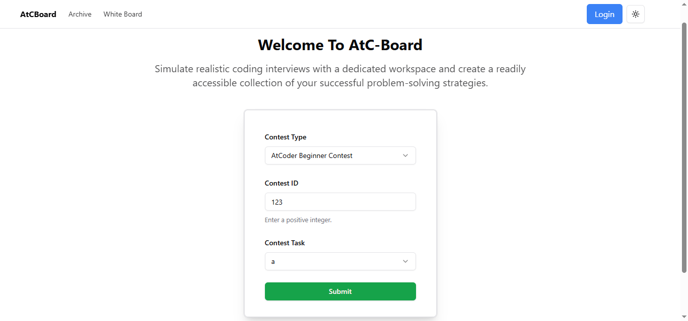

# AtCoder Board

AtCoder Board solves the problem of scattered and lost rough work during coding practice. It links each problem with a persistent digital scratchpad, keeping your visual thought process in one place. This maintains a reliable archive of practised problems and simulates the structured problem-solving environment of technical interviews.

## Get the Web App !

Get the deployed version of the app at https://atcb.vercel.app/

## API Reference

#### Home Page

```
  /
```

#### Archive

```
  /archive
```

#### Whiteboard

```
  /board
```

## Screenshots



## Tech Stack

**Frontend:**

* Next.js
* TypeScript
* Tailwind CSS
* Shadcn UI
* Excalidraw (`@excalidraw/excalidraw`)

**Backend**

* Node.js
* Express.js
* Puppeteer
* Cheerio
* CORS (`cors`)
* Body-parser (`body-parser`)

**Database**

* Firebase

**Deployment**

* Render

**Other:**

* npm
* Zod
* React Hook Form

## Features

- Light/dark mode toggle
- Live Content
- Problem Selection Form
- Interactive Whiteboard
- Many more to come ...

## Run Locally

Clone the project.

```bash
  git clone https://github.com/UmarSkh/AtCBoard.git
```

Go to the project directory.

```bash
  cd my-project
```

Install dependencies.

```bash
  npm install
```

Start the server.

```bash
  npm run dev
```

## Authors

- [@UmarSkh](https://github.com/UmarSkh)

## Contributing

Contributions are always welcome! Feel free to fork the repository and make a pull request.

### How to Contribute
- Fork the repository.
- Create a new branch (```git checkout -b feature-branch```).
- Make your changes.
- Commit your changes (```git commit -m 'Add new feature'```).
- Push to the branch (```git push origin feature-branch```).
- Open a pull request.

## Lessons Learned

This project was a rapid learning curve. I mastered Next.js fundamentals, web scraping techniques, and deployment workflows, all while utilizing Firebase for its database capabilities and implementing robust authentication. Essential skills like debugging and server management became second nature. My front-end capabilities were solidified by Tailwind CSS, leading to improved efficiency and design, while TypeScript enhanced code quality and maintainability across the project.

## Feedback

If you have any feedback, please let me know.
