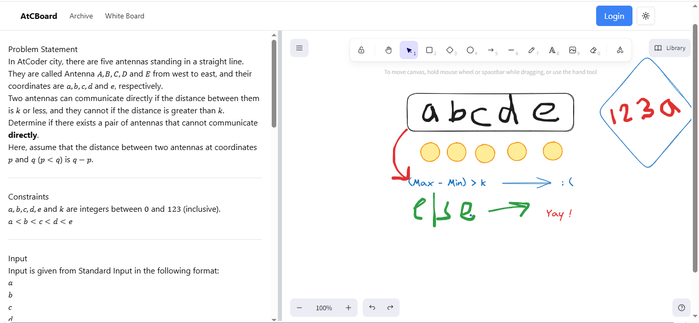

# AtCoder Board

A web app for online whiteboarding for AtCoder Questions.

## Get the Web App !

Get the deployed version of the app at https://atcb.vercel.app/

## API Reference

#### Home Page

```
  /
```

#### Whiteboard

```
  /board
```

## Screenshots




## Tech Stack

**Frontend:**

* Next.js
* TypeScript
* Tailwind CSS
* Shadcn UI
* Excalidraw (`@excalidraw/excalidraw`)

**Backend**

* Node.js
* Express.js
* Puppeteer
* Cheerio
* CORS (`cors`)
* Body-parser (`body-parser`)

**Deployment**

* Render

**Other:**

* npm
* Zod
* React Hook Form

## Features

- Light/dark mode toggle
- Live Content
- Problem Selection Form
- Interactive Whiteboard
- Many more to come ...

## Run Locally

Clone the project

```bash
  git clone https://github.com/UmarSkh/AtC-Board.git
```

Go to the project directory

```bash
  cd my-project
```

Install dependencies

```bash
  npm install
```

Start the server

```bash
  npm run dev
```

## Authors

- [@UmarSkh](https://github.com/UmarSkh)

## Contributing

Contributions are always welcome! Feel free to fork the repository and make a pull request.

### How to Contribute
- Fork the repository.
- Create a new branch (```git checkout -b feature-branch```).
- Make your changes.
- Commit your changes (```git commit -m 'Add new feature'```).
- Push to the branch (```git push origin feature-branch```).
- Open a pull request.

## Lessons Learned

This project was a rapid learning curve. I mastered Next.js fundamentals, web scraping techniques, and deployment workflows. Robust debugging and server management became essential skills. Tailwind CSS and TypeScript solidified my front-end capabilities, improving both efficiency and design. Future exploration of Firebase and authentication will expand upon this now-solid foundation.

## Feedback

If you have any feedback, please let us know.
